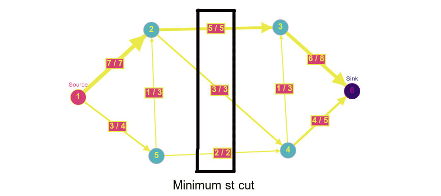

# Maximum Flow Using Ford Fulkerson's Algorithm

The objective of this project is to:
   1. Implement the Ford-Fulkerson algorithm to find the maximum flow and minimum st cut in a network flow graph.
   2. Use the implementation above to solve the problem of maximum bipartite matching


## Usage

1. Clone the repository locally.
2. Change the current working directory to the repository.
3. Run the following commands (for only Ford Fulkerson's algorithm):
   ```shell
   $ make main
   $ ./main <path_to_input>
   ```
   Run the following commands (for maximum bipartite matching):
   ```shell
   $ make main_bp
   $ ./main_bp <path_to_input>
   ```

#### Notes on usage

1. The specification of input file is as follows (for only Ford Fulkerson's algorithm):
   The first line should contain two integers $n$ and $m$, the number of vertices and edges respectively.
   Then $m$ lines should follow and each line should contain three integers $i$, $j$ and $c$  indicating an edge between vertex $i$ and vertex $j$ of capacity $c$.
    <br>
   The specification of input file is as follows (for maximum bipartite matching):
   The first line should contain two integers $n_1$, $n_2$ and $m$, the number of vertices in left set, the number of vertices in right set and number of edges between two sets respectively.
   Then $m$ lines should follow and each line should contain three integers $i$, $j$ and $c$  indicating an edge between vertex $i$ of left set and vertex $j$ right set of capacity $c$.
   Note that for each set the vertex numbering should start from $1$.
   <br>

2. Upon successful completion the results will print the value of min st cut and the vertices in `S` set and `T` set for `main` only and the maximum number of matchings and the match function (left -> right) for `main_bp` only.
<br>

3. Illustrative test cases can be found in `data/`.

## Results

File: small1.txt|
:-|
|

## Performance Analysis

Resource usage analysis was done using `/usr/bin/time`.
Sample command: `$ /usr/bin/time -v ./main data/test1.txt`

The following analyses and measurements are done on an 8GB memory system powered by Intel Core i7-8550U CPU running Ubuntu 18.04.

#### Ford Fulkerson's Algorithm
###### (Finding minimum st cut)

File|Vertices (n)|Edges (m)|Max flow|Min st cut|Memory usage|Execution time
----|----|---|---|---|---|--|
small1.txt|6|9|10|10|3,368 KB|0.0 s
small2.txt|8|12|9|9|3,404 KB|0.0 s
small3.txt|11|17|3|3|3,352 KB|0.0 s
test1.txt|4,752|34,247|251|251|8,780 KB|0.38 s

#### Maximum Bipartite Matching

File|Left v (n1)|Right v (n2)|Edges (m)|Max match|Memory usage|Execution time
----|----|---|---|---|---|---|
smallbp1.txt|5|5|8|5|3,252 KB | 0.0 s
bp1.txt|829|551|1,476|451|4,140 KB | 0.13 s
bp2.txt|16,726|22,015|58,595|451|4,140 KB | 0.13 s