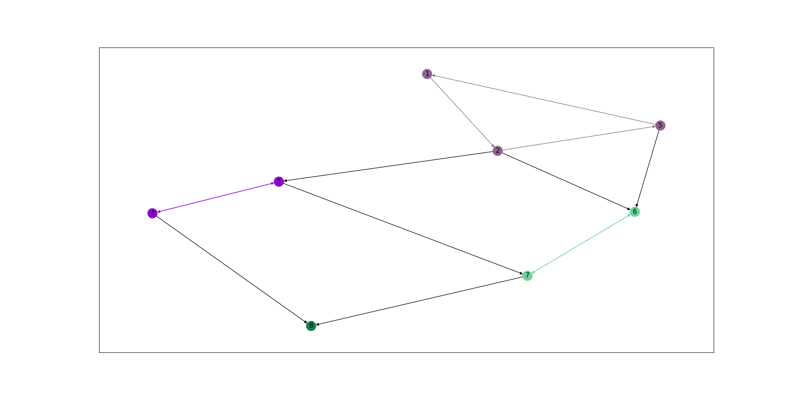
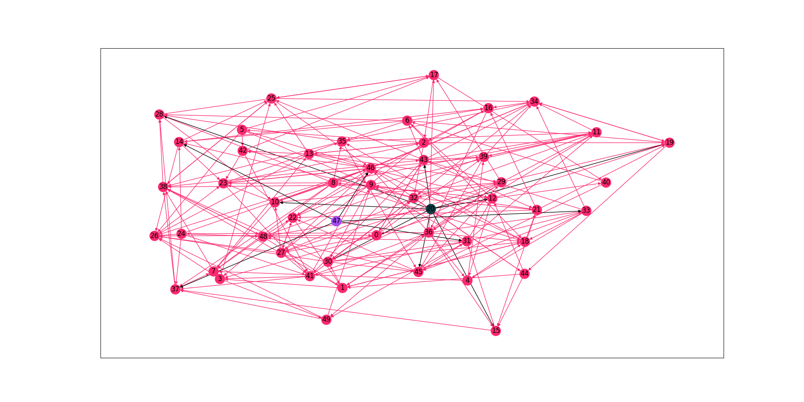
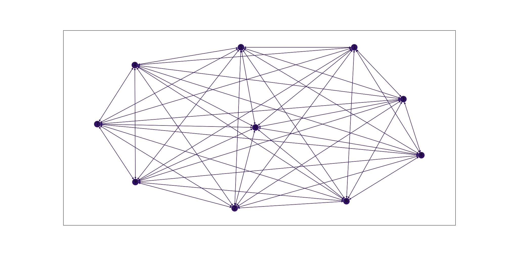
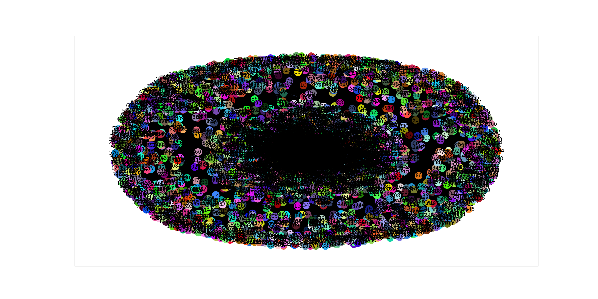

# Strongly Connected Components In Graphs

The objective of this project is to:
   1. Implement <a href = "https://en.wikipedia.org/wiki/Kosaraju%27s_algorithm">Kosaraju's linear time algorithm</a> to find strongly connected components (SCC) in directed graphs.
   2. Implement: <b>Coppersmith, Author & Fleischer, Don & Hendrickson, Lisa & Pinar, Bruce & Coppersmith, Don & Fleischer, Lisa & Hendrickson, Bruce & Pinar, Ali. (2005). A divide-and-conquer algorithm for identifying strongly connected components.</b> This is a divide and conquer algorithm (DCSC) that runs in $O(m \cdot logn)$ time, <i>on average</i>, where $m$ is the number of edges and $n$ is the number of vertices.
   3. Compare the performances of the algorithms in terms of memory utilization and execution times on large datasets.
   4. Visualize the SCC's obtained.


# Usage

1. Clone the repository locally.
2. Change the current working directory to the repository.
3. Run the following commands:
   ```shell
   $ make main
   $ ./main <path_to_input> <path_to_output>
   ```
4. To visualize the graph, make sure `g.visualize()` is uncommented in `main.cpp` before doing step 3. Then run the following command:
   ```shell
   $ python3 visualize.py <path_to_output_image>
   ```

#### Notes on usage

1. The specification of input file is as follows:
   The first line should contain two integers $n$ and $m$, the number of vertices and edges respectively.
   Then $m$ lines should follow and each line should contain two integers $i$ and $j$ indicating an edge between vertex $i$ and vertex $j$.
2. Uncommenting `g.visualize()` will generate `nodes.txt` and `edges.txt` for use by `visualize.py` in the cwd.
3. The repository is bundled with a random generator for randomly generating graphs of a specified size. It generates a file specifying a random graph in the format mentioned above. To use the generator, run the following commands:
    ```shell
    $ make generator
    $ ./generator <number_of_vertices> <path_to_output>
    ```
4. Running `visualize.py` requires Python 3 and the following libraries to be installed:
    ```
    networkx
    matplotlib
    ```

# Results

The images generated by running `visualize.py` color all vertices belonging to the same SCC and the edges that define the SCC with the same color. All other edges are colored in black.
<b> Self loops are not shown in the image.</b>

File: input1.txt|
:-|
$n = 8$<br>$m = 14$|

File: input6.txt|
:-|
$n = 50$<br>$m = 228$|

File: complete.txt|
:-|
$n = 10$<br>$m = 100$|

File: wiki-Vote.txt|
:-|
$n = 7115$<br>$m = 103689$|

# General Issues

1. For large datasets, to prevent the stack from overflowing due to excessive recursive function calls of depth first search, the stack size for a process was changed using the following command:
    ```
    $ ulimit -s unlimited
    ```

2. To improve the timing performance of the code, during compilation, the optimization level was set to `O3` using the `-O3` flag. This led to significant improvement in the performance ($\sim10$ times drop in execution time).

# Performance Analysis

Resource usage analysis was done using `/usr/bin/time`.
Sample command: `$ /usr/bin/time -v ./main data/input.txt data/output.txt`

The following analyses and measurements are done on an 8GB memory system powered by Intel Core i7-8550U CPU running Ubuntu 18.04.

Kosaraju's algorithm
-------

File|Vertices (n)|Edges (m)|SCC count|Memory usage|Execution time
----|----|---|---|---|---|
input1.txt|8|14|4|3,332 kB|0.0s
input3.txt|50|147|10|3,492 kB|0.0s
input6.txt|50|228|3|3,352 kB|0.0s
wiki-Vote.txt|7,115|103,689|5,816|7,364 kB|0.08s
slashdot.txt| 82,168|948,464| 10,559|43,948 kB|1.36s
twitter.txt |81,306| 2,420,766| 12,248|61,076 kB|4.17s
pokec.txt|1,632,803|30,622,564|325,892|988,844 kB|134.46s

DCSC
----

File|Vertices (n)|Edges (m)|SCC count|Memory usage|Execution time
----|----|---|---|---|---|
input1.txt|8|14|4|3,464 kB|0.0s
input3.txt|50|147|10|3,532 kB|0.0s
input6.txt|50|228|3|3,408 kB|0.0s
wiki-Vote.txt|7,115|103,689|5,816|10,560 kB|0.59s
slashdot.txt| 82,168|948,464| 10,559|75,668 kB|5.69s
twitter.txt |81,306| 2,420,766| 12,248|102,172 kB|8.92s
pokec.txt|1,632,803|30,622,564|325,892|1,629,440 kB|7,046.61s

Observations
---

- Kosaraju's algorithm performs significantly better than DCSC, as expected from their average case asymptotic time complexities.
- DCSC takes up more memory resources due to the multiple recursive calls made to the algorithm's routine.